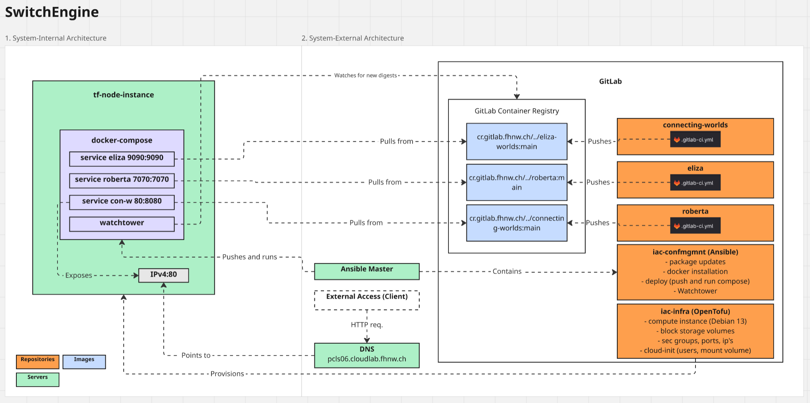

# Assessment 01

## Archtitectural Overview of sourcesystem

Deployment: docker-compose.yml + .env auf 1 VM.

Images: aus GitLab Container Registry (cr.gitlab.fhnw.ch/...).

Updates: Watchtower für Auto‑Pull & Rolling Restart.

Ports: 9090 (Eliza), 7070 (Roberta), 8080 (Orchestrator), ggf. 80/443 via Nginx/Port‑NAT.

###Feature

IaC provisioniert VM

Ansible deployt Compose‑Stack.

##Archtitectural Overview of targetsystem

image::./AWS_ECS.png[AWS Architecture, align=center]

Compute: AWS ECS on Fargate (serverless Tasks/Services).

Netz: Public Subnets (ALB), Private Subnets (Tasks), NAT für Outbound Pull.

Images: Pull aus GitLab Container Registry oder gespiegelt nach ECR.

Secrets: AWS Secrets Manager/SSM Parameter Store (z. B. Tokens, URLs).

Observability: CloudWatch Logs/metrics, ALB Access Logs.

###Feature

IaC (OpenTofu) erzeugt VPC/Subnets/ALB/ECS/SG/Route53.

##Migration Steps between source cloud and target cloud

Sketch the concrete migration steps between the source cloud and the target cloud.