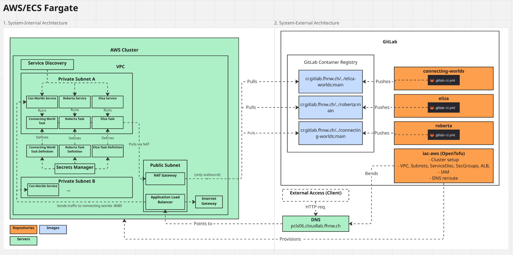

= Assessment 02: Cloud-to-Cloud Migration

== Architectural Overview of Source System (AWS)

*Infrastructure provisioning and deployment* via OpenTofu IaC:

- **Networking**: VPC with public/private subnets, ALB, NAT Gateway, security groups
- **Compute**: ECS Fargate services for three chatbots (Eliza, Roberta, Connecting Worlds)
- **Database**: DynamoDB for conversation history
- **Service Discovery**: Cloud Map for internal service communication
- **DNS**: Route53 for public domain management

== Architectural Overview of Target System (Azure)

*Infrastructure provisioning* via OpenTofu IaC:

- **Compute**: Azure Function Apps (Flex Consumption) for three chatbots
- **Database**: CosmosDB for conversation history storage
- **AI Services**: Azure AI Foundry with GPT-4o-mini deployment
- **Monitoring**: Application Insights and Log Analytics
- **Storage**: Azure Storage Account for function deployments

*Deployment* via `deploy.sh` script using zip upload method.

== Migration Steps between source cloud and target cloud

=== Prerequisites

- AWS credentials
- Azure CLI authenticated

=== Step-by-Step Migration

. **Provision Azure Infrastructure**
+
[source,bash]
----
cd azure-iac/infra
az login
tofu plan
tofu apply
----
+
The `connecting-worlds` function receives an environment variable (`CHAT_START_PAUSED=true`) that keeps the chat paused initially.

. **Deploy Azure Functions**
+
[source,bash]
----
cd ..
./deploy.sh all
----
+
This deploys all three functions (eliza, roberta, connecting-worlds). The connecting-worlds function starts in a paused state to prevent writing to CosmosDB before data migration.

. **Execute Migration Script**
+
Export AWS credentials:
+
[source,bash]
----
export AWS_ACCESS_KEY_ID="<your-access-key>"
export AWS_SECRET_ACCESS_KEY="<your-secret-key>"
export AWS_SESSION_TOKEN="<your-session-token>"
----
+
Run the migration:
+
[source,bash]
----
az login
./migrate.sh
----
+
The migration script performs these automated steps:

* *Step 1*: Pause AWS connecting-worlds (stops writing to DynamoDB)
* *Step 2*: Copy conversation data from DynamoDB to CosmosDB
* *Step 3*: Resume Azure connecting-worlds (starts writing to CosmosDB)
* *Step 4*: Update Route53 DNS records to point to Azure Function App:
  ** Add TXT record for Azure domain verification (if needed)
  ** Add custom domain to Azure Function App
  ** Update A record from AWS ALB alias to Azure Function App IP address

. **Verify Migration**
+
- Check Azure connecting-worlds web interface for conversation history
- Verify new conversations are persisted to CosmosDB
- Confirm DNS propagation and traffic routing

